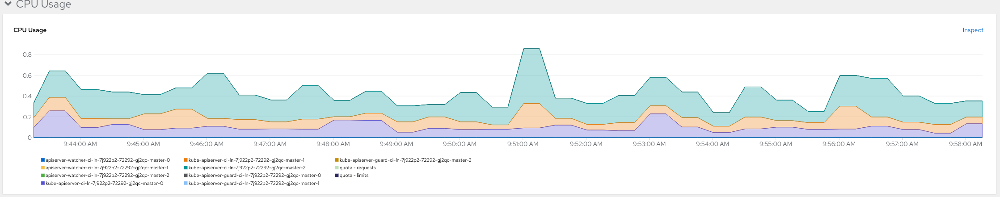
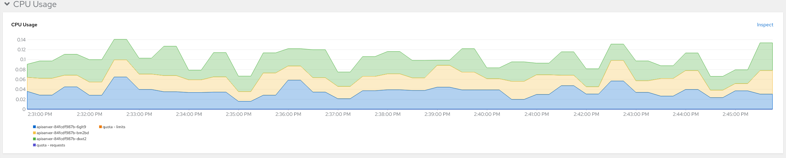

# scoped-memcached-operator
A version of the memcached operator tutorial that is meant to showcase an operator that implements the PoC tooling for scoping the cache of an operator based on RBAC.

## Demo
TODO(everettraven): add a demo with steps and a GIF
### Demo Steps
1. Create a KinD cluster by running:
```
kind create cluster
```

2. Install OLM by running:
```
operator-sdk olm install
```

3. Create the namespaces `allowed-one`, `allowed-two`, `denied` by running:
```
kubectl create namespace allowed-one && \
kubectl create namespace allowed-two && \
kubectl create namespace denied
```

4. Run the `scoped-operator-poc` bundle by using:
```
operator-sdk run bundle docker.io/bpalmer/scoped-operator-poc-bundle:v0.0.1 --index-image quay.io/operator-framework/opm:v1.23.0
```

5. Check the logs of the controller by running:
```
kubectl get pods
```
The output of the above command should look similar to:
```
NAME                                                              READY   STATUS      RESTARTS   AGE
docker-io-bpalmer-scoped-operator-poc-bundle-v0-0-1               1/1     Running     0          3m26s
e8e6907bee24c929d2149e20664349919c60c4cdcaffe2cc0ab62727a5w4gbj   0/1     Completed   0          3m20s
scoped-memcached-operator-controller-manager-bd5c4bcd5-mkzgx      2/2     Running     0          3m2s
```
using the last name in the list run:
```
kubectl logs scoped-memcached-operator-controller-manager-bd5c4bcd5-mkzgx
```
We should see that there is some warnings that look similar to:
```
W0803 19:41:11.428241       1 reflector.go:442] pkg/mod/k8s.io/client-go@v0.24.3/tools/cache/reflector.go:167: watch of *v1.Deployment ended with: very short watch: pkg/mod/k8s.io/client-go@v0.24.3/tools/cache/reflector.go:167: Unexpected watch close - watch lasted less than a second and no items received
```
This is what we are expecting because we have not applied any RBAC to allow the permissions that the operator needs.

6. Give the operator all it's permissions in only the `allowed-one` and `allowed-two` namespaces by running:
```
kubectl apply -f scoped-rbac.yaml
```
This will create a `RoleBinding` for both the `allowed-one` and `allowed-two` namespaces, binding the `ClusterRole` named `scoped-memcached-operator-manager-role`. This `ClusterRole` gives the operator all the permissions it needs to operate properly and the `RoleBinding`s that we created restrict the operator to only being able to operate within the `allowed-one` and `allowed-two` namespaces.

7. Restart the operator by running:
```
kubectl delete pods scoped-memcached-operator-controller-manager-bd5c4bcd5-mkzgx
```
We need to restart the operator so that it can detect the changes to RBAC. If you run `kubectl get pods` you should see that a new pod is started (it will have a new random suffix)

8. Check the logs of the new operator pod by running:
```
kubectl logs <new pod name>
```
We should now see that there are no warnings in the logs.

9. Create a `Memcached` CR in the namespaces `allowed-one`, `allowed-two`, and `denied` by running:
```
kubectl apply -f config/samples/cache_v1alpha1_memcached.yaml
```

10. Check the logs of the operator pod again to see that it only sees the `Memcached` CR in the `allowed-one` and `allowed-two` namespaces:
We should see in the logs something similar to:
```
1.6595566108983996e+09  INFO    Creating a new Deployment       {"controller": "memcached", "controllerGroup": "cache.example.com", "controllerKind": "Memcached", "Memcached": {"name":"memcached-sample-allowed-one","namespace":"allowed-one"}, "namespace": "allowed-one", "name": "memcached-sample-allowed-one", "reconcileID": "7badea18-c2ef-4eb3-a05f-18f6116a1cad", "Deployment.Namespace": "allowed-one", "Deployment.Name": "memcached-sample-allowed-one"}
1.6595566110150063e+09  INFO    Creating a new Deployment       {"controller": "memcached", "controllerGroup": "cache.example.com", "controllerKind": "Memcached", "Memcached": {"name":"memcached-sample-allowed-two","namespace":"allowed-two"}, "namespace": "allowed-two", "name": "memcached-sample-allowed-two", "reconcileID": "644e89c2-2b3f-4917-a375-62d302934875", "Deployment.Namespace": "allowed-two", "Deployment.Name": "memcached-sample-allowed-two"}
```
Here we can see it processed the `Memcached` CRs that were created in the `allowed-one` and `allowed-two` namespaces. We can see that it has gone ahead and created a Deployment as expected for each `Memcached` CR.

11. Check the `allowed-one` namespace to see the deployment:
```
kubectl -n allowed-one get deployments
```
The output of the above command should look similar to:
```
NAME                           READY   UP-TO-DATE   AVAILABLE   AGE
memcached-sample-allowed-one   2/2     2            2           4m1s
```

We can also check that the pods are up and running by running:
```
kubectl -n allowed-one get pods
```

12. Check the `allowed-two` namespace to see the deployment:
```
kubectl -n allowed-two get deployments
```
The output of the above command should look similar to:
```
NAME                           READY   UP-TO-DATE   AVAILABLE   AGE
memcached-sample-allowed-two   3/3     3            3           6m25s
```

We can also check that the pods are up and running by running:
```
kubectl -n allowed-two get pods
```

13. Check the `denied` namespace to see that there is no deployment:
```
kubectl -n denied get deployments
```
The output of the above command should look similar to:
```
No resources found in denied namespace.
```

We can also check that there are no pods by running:
```
kubectl -n denied get pods
```

14. Modify the RBAC so that the operator has cluster level permissions:
Delete the Scoped RBAC:
```
kubectl delete -f scoped-rbac.yaml
```

Add the cluster level RBAC:
```
kubectl apply -f cluster-rbac.yaml
```

Restart the pod:
```
kubectl delete pods <pod name>
```

Checking logs of the recreated pod we should see that the `denied` namespace is now picked up:
```
1.6596357899393613e+09  INFO    controller-runtime.metrics      Metrics server is starting to listen    {"addr": "127.0.0.1:8080"}
1.6596357899396393e+09  INFO    setup   starting manager
1.6596357899398506e+09  INFO    Starting server {"path": "/metrics", "kind": "metrics", "addr": "127.0.0.1:8080"}
1.6596357899398506e+09  INFO    Starting server {"kind": "health probe", "addr": "[::]:8081"}
I0804 17:56:29.939851       1 leaderelection.go:248] attempting to acquire leader lease default/86f835c3.example.com...
I0804 17:56:46.171207       1 leaderelection.go:258] successfully acquired lease default/86f835c3.example.com
1.6596358061712558e+09  DEBUG   events  Normal  {"object": {"kind":"Lease","namespace":"default","name":"86f835c3.example.com","uid":"cd3ca92f-73d9-4b5a-87a7-4908f8bb8d2b","apiVersion":"coordination.k8s.io/v1","resourceVersion":"1837"}, "reason": "LeaderElection", "message": "scoped-memcached-operator-controller-manager-5c79979f7-wmwcc_039e32b2-047f-40c3-ac86-49145f88645f became leader"}
1.6596358061715274e+09  INFO    Starting EventSource    {"controller": "memcached", "controllerGroup": "cache.example.com", "controllerKind": "Memcached", "source": "kind source: *v1alpha1.Memcached"}
1.659635806171623e+09   INFO    Starting EventSource    {"controller": "memcached", "controllerGroup": "cache.example.com", "controllerKind": "Memcached", "source": "kind source: *v1.Deployment"}
1.6596358061716423e+09  INFO    Starting Controller     {"controller": "memcached", "controllerGroup": "cache.example.com", "controllerKind": "Memcached"}
1.65963580627454e+09    INFO    Starting workers        {"controller": "memcached", "controllerGroup": "cache.example.com", "controllerKind": "Memcached", "worker count": 1}
1.6596358063759797e+09  INFO    Creating a new Deployment       {"controller": "memcached", "controllerGroup": "cache.example.com", "controllerKind": "Memcached", "Memcached": {"name":"memcached-sample-denied","namespace":"denied"}, "namespace": "denied", "name": "memcached-sample-denied", "reconcileID": "3676df2f-df1e-4fa6-af2f-98023013a458", "Deployment.Namespace": "denied", "Deployment.Name": "memcached-sample-denied"}
```

### Demo GIF 


# Performance Evaluation

The following is a performance evaluation to determine how the number of connections/requests affects the performance of the Kubernetes API Server and etcd in a few differnt scenarios:
1. Cluster level List/Watch permissions
2. Single namespace with List/Watch permissions
3. 10/100/1000 namespaces with List/Watch permissions

When scoping an operator the formula for determining the number of connections/requests made to the Kubernetes API Server is as follows:

**Note:** 
- N = # of namespaces on the cluster
- R = # of resources being listed/watched by the operator
- P = # of permitted namespaces

When the operator is given cluster level permissions for all resources:
- List Formula: `x = 2R`
    - Creates one `SelfSubjectAccessReview` and one `List` request for each resource
- Watch Formula: `x = 3R`
    - Creates one `SelfSubjectAccessReview`, one `List` request, and one `Watch` request for each resource
- For example, if an operator is given cluster level permissions for 3 resources, the number of requests/connections would be:
    - List request: `x = 2(3) = 6`
    - Watch request: `x = 3(3) = 9`

When the operator is scoped to a set of namespaces:
- List Formula: `x = NR + PR`
    - Creates a `SelfSubjectAccessReview` for each namespace on the cluster for each resource 
    - Creates a `List` request for each permitted namespace for each resource
- Watch Formula: `x = 2NR + 2PR`
    - Creates two `SelfSubjectAccessReview`s for each namespace on the cluster (one during the `List` and one during the `Watch` requests) for each resource
    - Creates one `List` and one `Watch` request for each permitted namespace for each resource
- For example, if an operator is run on a cluster with 10 namespaces and is scoped to 3 namespaces for 3 resources, the number of requests/connections would be:
    - List request: `x = (10)(3) + (3)(3) = 30 + 9 = 39`
    - Watch request: `x = 2(10)(3) + 2(3)(3) = 60 + 18 = 78`

## All Namespaces/Cluster Permissions

**Before**

- *CPU Usage Graph - OS API Server*


- *Memory Usage Graph - OS API Server*


- *Metric Cards - OS API Server*


- *CPU Usage Graph - OS Kube API Server*


- *Memory Usage Graph - OS Kube API Server*


- *Metric Cards - OS Kube API Server*


- *CPU Usage Graph - OS etcd*


- *Memory Usage Graph - OS etcd*


- *Metric Cards - OS etcd*


**After - Restarted with permissisons at 10 AM**

All images captured ~5 minutes after controller started

- *CPU Usage Graph - OS API Server*


- *Memory Usage Graph - OS API Server*


- *Metric Cards - OS API Server*


- *CPU Usage Graph - OS Kube API Server*


- *Memory Usage Graph - OS Kube API Server*


- *Metric Cards - OS Kube API Server*


- *CPU Usage Graph - OS etcd*


- *Memory Usage Graph - OS etcd*


- *Metric Cards - OS etcd*


## Single Namespace Permissions

**Before**

- *CPU Usage Graph - OS API Server*


- *Memory Usage Graph - OS API Server*


- *Metric Cards - OS API Server*


- *CPU Usage Graph - OS Kube API Server*


- *Memory Usage Graph - OS Kube API Server*


- *Metric Cards - OS Kube API Server*


- *CPU Usage Graph - OS etcd*


- *Memory Usage Graph - OS etcd*


- *Metric Cards - OS etcd*


**After - Restarted with permissisons at 11 AM**

All images captured ~5 minutes after controller started

- *CPU Usage Graph - OS API Server*


- *Memory Usage Graph - OS API Server*


- *Metric Cards - OS API Server*


- *CPU Usage Graph - OS Kube API Server*


- *Memory Usage Graph - OS Kube API Server*


- *Metric Cards - OS Kube API Server*


- *CPU Usage Graph - OS etcd*


- *Memory Usage Graph - OS etcd*


- *Metric Cards - OS etcd*


## Multiple Namespace Permissions

### 10 Namespaces

**Before**

- *CPU Usage Graph - OS API Server*


- *Memory Usage Graph - OS API Server*


- *Metric Cards - OS API Server*


- *CPU Usage Graph - OS Kube API Server*


- *Memory Usage Graph - OS Kube API Server*

Controller started at 2:10 PM (forgot to take a picture of memory graph before the controller was started)

- *Metric Cards - OS Kube API Server*


- *CPU Usage Graph - OS etcd*


- *Memory Usage Graph - OS etcd*


- *Metric Cards - OS etcd*


**After - Restarted with permissisons at 2:10 PM**

All images captured ~5 minutes after controller started

- *CPU Usage Graph - OS API Server*


- *Memory Usage Graph - OS API Server*


- *Metric Cards - OS API Server*


- *CPU Usage Graph - OS Kube API Server*


- *Memory Usage Graph - OS Kube API Server*

Controller started at 2:10 PM (forgot to take a picture of memory graph before the controller was started)

- *Metric Cards - OS Kube API Server*


- *CPU Usage Graph - OS etcd*


- *Memory Usage Graph - OS etcd*


- *Metric Cards - OS etcd*


---

### 100 Namespaces

*Note:* The before images are based on the controller still running with 10 namespaces. The after images will be based on when the controller was restarted to refresh the cache to add the additional 90 namespaces.

**Before**

- *CPU Usage Graph - OS API Server*


- *Memory Usage Graph - OS API Server*


- *Metric Cards - OS API Server*


- *CPU Usage Graph - OS Kube API Server*


- *Memory Usage Graph - OS Kube API Server*


- *Metric Cards - OS Kube API Server*


- *CPU Usage Graph - OS etcd*


- *Memory Usage Graph - OS etcd*


- *Metric Cards - OS etcd*


**After - Restarted with permissisons at 2:49 PM**

All images captured ~5 minutes after controller started

- *CPU Usage Graph - OS API Server*


- *Memory Usage Graph - OS API Server*


- *Metric Cards - OS API Server*


- *CPU Usage Graph - OS Kube API Server*


- *Memory Usage Graph - OS Kube API Server*


- *Metric Cards - OS Kube API Server*


- *CPU Usage Graph - OS etcd*


- *Memory Usage Graph - OS etcd*


- *Metric Cards - OS etcd*


---

### 1000 Namespaces

*Note:* The before images are based on the controller still running with 100 namespaces. The after images will be based on when the controller was restarted to refresh the cache to add the additional 900 namespaces.

**Before**

- *CPU Usage Graph - OS API Server*


- *Memory Usage Graph - OS API Server*


- *Metric Cards - OS API Server*


- *CPU Usage Graph - OS Kube API Server*


- *Memory Usage Graph - OS Kube API Server*


- *Metric Cards - OS Kube API Server*


- *CPU Usage Graph - OS etcd*


- *Memory Usage Graph - OS etcd*


- *Metric Cards - OS etcd*


**After - Restarted with permissisons at 3:27 PM**

All images captured ~5 minutes after controller started

- *CPU Usage Graph - OS API Server*


- *Memory Usage Graph - OS API Server*


- *Metric Cards - OS API Server*


- *CPU Usage Graph - OS Kube API Server*


- *Memory Usage Graph - OS Kube API Server*


- *Metric Cards - OS Kube API Server*


- *CPU Usage Graph - OS etcd*


- *Memory Usage Graph - OS etcd*


- *Metric Cards - OS etcd*


# Scoped Cache Testing

## Cases
1. Watch a resource across the cluster
2. Watch a resource in a specific namespaces
3. Watch a specific resource in a namespace

To cover all these cases, operator should:
1. Watch CRs at the cluster level
2. Watch Deployments in namespaces where CRs are created
3. Watch a Secret in a specific namespace


## Demo

1. Run `setup.sh` to:
    - Delete existing KinD cluster
    - Create a new KinD cluster
    - Apply RBAC to give permissions to list all namespaces on the cluster
    - Apply RBAC to give * permissions for Memcached resources on the cluster
    - Create namespaces `allowed-one`, `allowed-two`, `denied`
    - Apply RBAC to give * permissions for Deployment resources in the `allowed-one` and `allowed-two` namespaces
    - Apply RBAC to give `get`, `list`, `watch` permissiosn for Pod resources in the `allowed-one` and `allowed-two` namespaces

2. Run `redeploy.sh` to:
    - Remove any existing deployments of the operator from the cluster
    - Build the image for the operator
    - Load the built image to the KinD cluster
    - Deploy the operator on the cluster
    - List the pods in the `scoped-memcached-operator-system` namespace so we can easily copy the pod name for when we take a look at the pod logs

3. 


## License

Copyright 2022.

Licensed under the Apache License, Version 2.0 (the "License");
you may not use this file except in compliance with the License.
You may obtain a copy of the License at

    http://www.apache.org/licenses/LICENSE-2.0

Unless required by applicable law or agreed to in writing, software
distributed under the License is distributed on an "AS IS" BASIS,
WITHOUT WARRANTIES OR CONDITIONS OF ANY KIND, either express or implied.
See the License for the specific language governing permissions and
limitations under the License.

