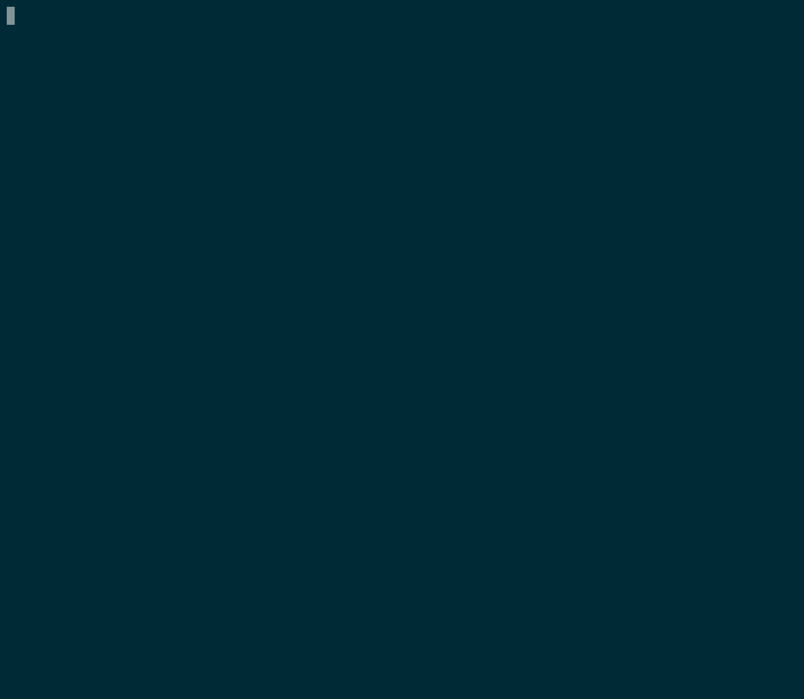

# scoped-memcached-operator
A version of the memcached operator tutorial that is meant to showcase an operator that implements the PoC tooling for scoping the cache of an operator based on RBAC.

## Demo
### Demo Steps
1. Create a KinD cluster by running:
```
kind create cluster
```

2. Install OLM by running:
```
operator-sdk olm install
```

3. Create the namespaces `allowed-one`, `allowed-two`, `denied` by running:
```
kubectl create namespace allowed-one && \
kubectl create namespace allowed-two && \
kubectl create namespace denied
```

4. Run the `scoped-operator-poc` bundle by using:
```
operator-sdk run bundle docker.io/bpalmer/scoped-operator-poc-bundle:v0.0.1 --index-image quay.io/operator-framework/opm:v1.23.0
```

5. Check the logs of the controller by running:
```
kubectl get pods
```
The output of the above command should look similar to:
```
NAME                                                              READY   STATUS      RESTARTS   AGE
docker-io-bpalmer-scoped-operator-poc-bundle-v0-0-1               1/1     Running     0          3m26s
e8e6907bee24c929d2149e20664349919c60c4cdcaffe2cc0ab62727a5w4gbj   0/1     Completed   0          3m20s
scoped-memcached-operator-controller-manager-bd5c4bcd5-mkzgx      2/2     Running     0          3m2s
```
using the last name in the list run:
```
kubectl logs scoped-memcached-operator-controller-manager-bd5c4bcd5-mkzgx
```
We should see that there is some warnings that look similar to:
```
W0803 19:41:11.428241       1 reflector.go:442] pkg/mod/k8s.io/client-go@v0.24.3/tools/cache/reflector.go:167: watch of *v1.Deployment ended with: very short watch: pkg/mod/k8s.io/client-go@v0.24.3/tools/cache/reflector.go:167: Unexpected watch close - watch lasted less than a second and no items received
```
This is what we are expecting because we have not applied any RBAC to allow the permissions that the operator needs.

6. Give the operator all it's permissions in only the `allowed-one` and `allowed-two` namespaces by running:
```
kubectl apply -f scoped-rbac.yaml
```
This will create a `RoleBinding` for both the `allowed-one` and `allowed-two` namespaces, binding the `ClusterRole` named `scoped-memcached-operator-manager-role`. This `ClusterRole` gives the operator all the permissions it needs to operate properly and the `RoleBinding`s that we created restrict the operator to only being able to operate within the `allowed-one` and `allowed-two` namespaces.

7. Restart the operator by running:
```
kubectl delete pods scoped-memcached-operator-controller-manager-bd5c4bcd5-mkzgx
```
We need to restart the operator so that it can detect the changes to RBAC. If you run `kubectl get pods` you should see that a new pod is started (it will have a new random suffix)

8. Check the logs of the new operator pod by running:
```
kubectl logs <new pod name>
```
We should now see that there are no warnings in the logs.

9. Create a `Memcached` CR in the namespaces `allowed-one`, `allowed-two`, and `denied` by running:
```
kubectl apply -f config/samples/cache_v1alpha1_memcached.yaml
```

10. Check the logs of the operator pod again to see that it only sees the `Memcached` CR in the `allowed-one` and `allowed-two` namespaces:
We should see in the logs something similar to:
```
1.6595566108983996e+09  INFO    Creating a new Deployment       {"controller": "memcached", "controllerGroup": "cache.example.com", "controllerKind": "Memcached", "Memcached": {"name":"memcached-sample-allowed-one","namespace":"allowed-one"}, "namespace": "allowed-one", "name": "memcached-sample-allowed-one", "reconcileID": "7badea18-c2ef-4eb3-a05f-18f6116a1cad", "Deployment.Namespace": "allowed-one", "Deployment.Name": "memcached-sample-allowed-one"}
1.6595566110150063e+09  INFO    Creating a new Deployment       {"controller": "memcached", "controllerGroup": "cache.example.com", "controllerKind": "Memcached", "Memcached": {"name":"memcached-sample-allowed-two","namespace":"allowed-two"}, "namespace": "allowed-two", "name": "memcached-sample-allowed-two", "reconcileID": "644e89c2-2b3f-4917-a375-62d302934875", "Deployment.Namespace": "allowed-two", "Deployment.Name": "memcached-sample-allowed-two"}
```
Here we can see it processed the `Memcached` CRs that were created in the `allowed-one` and `allowed-two` namespaces. We can see that it has gone ahead and created a Deployment as expected for each `Memcached` CR.

11. Check the `allowed-one` namespace to see the deployment:
```
kubectl -n allowed-one get deployments
```
The output of the above command should look similar to:
```
NAME                           READY   UP-TO-DATE   AVAILABLE   AGE
memcached-sample-allowed-one   2/2     2            2           4m1s
```

We can also check that the pods are up and running by running:
```
kubectl -n allowed-one get pods
```

12. Check the `allowed-two` namespace to see the deployment:
```
kubectl -n allowed-two get deployments
```
The output of the above command should look similar to:
```
NAME                           READY   UP-TO-DATE   AVAILABLE   AGE
memcached-sample-allowed-two   3/3     3            3           6m25s
```

We can also check that the pods are up and running by running:
```
kubectl -n allowed-two get pods
```

13. Check the `denied` namespace to see that there is no deployment:
```
kubectl -n denied get deployments
```
The output of the above command should look similar to:
```
No resources found in denied namespace.
```

We can also check that there are no pods by running:
```
kubectl -n denied get pods
```

14. Modify the RBAC so that the operator has cluster level permissions:
Delete the Scoped RBAC:
```
kubectl delete -f scoped-rbac.yaml
```

Add the cluster level RBAC:
```
kubectl apply -f cluster-rbac.yaml
```

Restart the pod:
```
kubectl delete pods <pod name>
```

Checking logs of the recreated pod we should see that the `denied` namespace is now picked up:
```
1.6596357899393613e+09  INFO    controller-runtime.metrics      Metrics server is starting to listen    {"addr": "127.0.0.1:8080"}
1.6596357899396393e+09  INFO    setup   starting manager
1.6596357899398506e+09  INFO    Starting server {"path": "/metrics", "kind": "metrics", "addr": "127.0.0.1:8080"}
1.6596357899398506e+09  INFO    Starting server {"kind": "health probe", "addr": "[::]:8081"}
I0804 17:56:29.939851       1 leaderelection.go:248] attempting to acquire leader lease default/86f835c3.example.com...
I0804 17:56:46.171207       1 leaderelection.go:258] successfully acquired lease default/86f835c3.example.com
1.6596358061712558e+09  DEBUG   events  Normal  {"object": {"kind":"Lease","namespace":"default","name":"86f835c3.example.com","uid":"cd3ca92f-73d9-4b5a-87a7-4908f8bb8d2b","apiVersion":"coordination.k8s.io/v1","resourceVersion":"1837"}, "reason": "LeaderElection", "message": "scoped-memcached-operator-controller-manager-5c79979f7-wmwcc_039e32b2-047f-40c3-ac86-49145f88645f became leader"}
1.6596358061715274e+09  INFO    Starting EventSource    {"controller": "memcached", "controllerGroup": "cache.example.com", "controllerKind": "Memcached", "source": "kind source: *v1alpha1.Memcached"}
1.659635806171623e+09   INFO    Starting EventSource    {"controller": "memcached", "controllerGroup": "cache.example.com", "controllerKind": "Memcached", "source": "kind source: *v1.Deployment"}
1.6596358061716423e+09  INFO    Starting Controller     {"controller": "memcached", "controllerGroup": "cache.example.com", "controllerKind": "Memcached"}
1.65963580627454e+09    INFO    Starting workers        {"controller": "memcached", "controllerGroup": "cache.example.com", "controllerKind": "Memcached", "worker count": 1}
1.6596358063759797e+09  INFO    Creating a new Deployment       {"controller": "memcached", "controllerGroup": "cache.example.com", "controllerKind": "Memcached", "Memcached": {"name":"memcached-sample-denied","namespace":"denied"}, "namespace": "denied", "name": "memcached-sample-denied", "reconcileID": "3676df2f-df1e-4fa6-af2f-98023013a458", "Deployment.Namespace": "denied", "Deployment.Name": "memcached-sample-denied"}
```

### Demo GIF 


### New Demo run down
This demo assumes that you are running the operator from within the root directory of the project

### Start the operator
Run `setup.sh` to:
- Delete existing KinD cluster
- Create a new KinD cluster
- Apply RBAC to give the following cluster level permissions:
    - `create`, `delete`, `list`, `watch`, `patch`, `get`, and `update` permissions for `memcacheds` resources
    - `update` permissions for `memcacheds/finalizers` sub-resource
    - `get`, `patch`, `update` permissions for `memcacheds/status` sub-resource
- Create namespaces `allowed-one`, `allowed-two`, `denied`
- Apply RBAC to give `create`, `delete`, `get`, `list`, `patch`, `update`, and `watch` permissions for `deployments` resources in the `allowed-one` and `allowed-two` namespaces
- Apply RBAC to give `get`, `list`, `watch` permissiosn for `pods` resources in the `allowed-one` and `allowed-two` namespaces

Run `redeploy.sh` to:
- Remove any existing deployments of the operator from the cluster
- Build the image for the operator
- Load the built image to the KinD cluster
- Deploy the operator on the cluster
- List the pods in the `scoped-memcached-operator-system` namespace so we can easily copy the pod name for when we take a look at the operator pod logs

Watch the logs by running:
```
kubectl -n scoped-memcached-operator-system logs -f <pod-name>
```

We should see that the operator has started successfully:
```
1.6608304693692005e+09  INFO    controller-runtime.metrics      Metrics server is starting to listen    {"addr": "127.0.0.1:8080"}
1.660830469369386e+09   INFO    setup   starting manager
1.6608304693696425e+09  INFO    Starting server {"kind": "health probe", "addr": "[::]:8081"}
1.6608304693696718e+09  INFO    Starting server {"path": "/metrics", "kind": "metrics", "addr": "127.0.0.1:8080"}
I0818 13:47:49.369663       1 leaderelection.go:248] attempting to acquire leader lease scoped-memcached-operator-system/86f835c3.example.com...
I0818 13:47:49.373329       1 leaderelection.go:258] successfully acquired lease scoped-memcached-operator-system/86f835c3.example.com
1.6608304693733532e+09  DEBUG   events  Normal  {"object": {"kind":"Lease","namespace":"scoped-memcached-operator-system","name":"86f835c3.example.com","uid":"ac82b4f7-a193-4d52-864b-315e1fc80ce1","apiVersion":"coordination.k8s.io/v1","resourceVersion":"564"}, "reason": "LeaderElection", "message": "scoped-memcached-operator-controller-manager-7b4c9bb485-7jlkh_666ab6d0-e194-43c8-8348-724608e1521e became leader"}
1.6608304693735454e+09  INFO    Starting EventSource    {"controller": "memcached", "controllerGroup": "cache.example.com", "controllerKind": "Memcached", "source": "kind source: *v1alpha1.Memcached"}
1.6608304693736055e+09  INFO    Starting Controller     {"controller": "memcached", "controllerGroup": "cache.example.com", "controllerKind": "Memcached"}
1.660830469473995e+09   INFO    Starting workers        {"controller": "memcached", "controllerGroup": "cache.example.com", "controllerKind": "Memcached", "worker count": 1}
```

> **Note**
> The above command will run in the foreground and block your terminal. For the rest of the demo steps you will need to open another terminal tab/window.

### Apply the samples
Create some `Memcached` resources in the `allowed-one`, `allowed-two`, and `denied` namespaces by running:
```
kubectl apply -f config/samples/cache_v1alpha1_memcached.yaml
```

### Check logs
The logs should end up showing something along the lines of:
```
1.6675789046986663e+09	INFO	Starting EventSource	{"controller": "memcached", "controllerGroup": "cache.example.com", "controllerKind": "Memcached", "source": "kind source: *v1.Deployment"}
1.6675789047042878e+09	INFO	Starting EventSource	{"controller": "memcached", "controllerGroup": "cache.example.com", "controllerKind": "Memcached", "source": "kind source: *v1.Pod"}
1.6675789047125015e+09	INFO	Starting EventSource	{"controller": "memcached", "controllerGroup": "cache.example.com", "controllerKind": "Memcached", "source": "kind source: *v1.Deployment"}
1.6675789047170875e+09	INFO	Starting EventSource	{"controller": "memcached", "controllerGroup": "cache.example.com", "controllerKind": "Memcached", "source": "kind source: *v1.Pod"}
1.6675789047224104e+09	INFO	Starting EventSource	{"controller": "memcached", "controllerGroup": "cache.example.com", "controllerKind": "Memcached", "source": "kind source: *v1.Deployment"}
W1104 16:21:44.724027       1 reflector.go:324] pkg/mod/k8s.io/client-go@v0.24.3/tools/cache/reflector.go:167: failed to list *v1.Deployment: deployments.apps is forbidden: User "system:serviceaccount:scoped-memcached-operator-system:scoped-memcached-operator-controller-manager" cannot list resource "deployments" in API group "apps" in the namespace "denied"
1.6675789047250595e+09	INFO	Starting EventSource	{"controller": "memcached", "controllerGroup": "cache.example.com", "controllerKind": "Memcached", "source": "kind source: *v1.Pod"}
W1104 16:21:44.726725       1 reflector.go:324] pkg/mod/k8s.io/client-go@v0.24.3/tools/cache/reflector.go:167: failed to list *v1.Pod: pods is forbidden: User "system:serviceaccount:scoped-memcached-operator-system:scoped-memcached-operator-controller-manager" cannot list resource "pods" in API group "" in the namespace "denied"
W1104 16:21:45.920566       1 reflector.go:324] pkg/mod/k8s.io/client-go@v0.24.3/tools/cache/reflector.go:167: failed to list *v1.Deployment: deployments.apps is forbidden: User "system:serviceaccount:scoped-memcached-operator-system:scoped-memcached-operator-controller-manager" cannot list resource "deployments" in API group "apps" in the namespace "denied"
W1104 16:21:45.920575       1 reflector.go:324] pkg/mod/k8s.io/client-go@v0.24.3/tools/cache/reflector.go:167: failed to list *v1.Pod: pods is forbidden: User "system:serviceaccount:scoped-memcached-operator-system:scoped-memcached-operator-controller-manager" cannot list resource "pods" in API group "" in the namespace "denied"
W1104 16:21:47.718548       1 reflector.go:324] pkg/mod/k8s.io/client-go@v0.24.3/tools/cache/reflector.go:167: failed to list *v1.Deployment: deployments.apps is forbidden: User "system:serviceaccount:scoped-memcached-operator-system:scoped-memcached-operator-controller-manager" cannot list resource "deployments" in API group "apps" in the namespace "denied"
W1104 16:21:48.298549       1 reflector.go:324] pkg/mod/k8s.io/client-go@v0.24.3/tools/cache/reflector.go:167: failed to list *v1.Pod: pods is forbidden: User "system:serviceaccount:scoped-memcached-operator-system:scoped-memcached-operator-controller-manager" cannot list resource "pods" in API group "" in the namespace "denied"
1.6675789114323611e+09	INFO	Deployment not found - Creating one!	{"controller": "memcached", "controllerGroup": "cache.example.com", "controllerKind": "Memcached", "memcached": {"name":"memcached-sample-allowed-one","namespace":"allowed-one"}, "namespace": "allowed-one", "name": "memcached-sample-allowed-one", "reconcileID": "6a99c6cd-77fa-4112-8a96-e3dd613302f2", "error": "deployments.apps \"could not find the given resource\" not found"}
1.6675789114324524e+09	INFO	Creating a new Deployment	{"controller": "memcached", "controllerGroup": "cache.example.com", "controllerKind": "Memcached", "memcached": {"name":"memcached-sample-allowed-one","namespace":"allowed-one"}, "namespace": "allowed-one", "name": "memcached-sample-allowed-one", "reconcileID": "6a99c6cd-77fa-4112-8a96-e3dd613302f2", "Deployment.Namespace": "allowed-one", "Deployment.Name": "memcached-sample-allowed-one"}
1.6675789116079628e+09	INFO	Deployment not found - Creating one!	{"controller": "memcached", "controllerGroup": "cache.example.com", "controllerKind": "Memcached", "memcached": {"name":"memcached-sample-allowed-two","namespace":"allowed-two"}, "namespace": "allowed-two", "name": "memcached-sample-allowed-two", "reconcileID": "3b370f14-7ba5-4d40-ac65-9a80fabad40d", "error": "deployments.apps \"could not find the given resource\" not found"}
1.6675789116079917e+09	INFO	Creating a new Deployment	{"controller": "memcached", "controllerGroup": "cache.example.com", "controllerKind": "Memcached", "memcached": {"name":"memcached-sample-allowed-two","namespace":"allowed-two"}, "namespace": "allowed-two", "name": "memcached-sample-allowed-two", "reconcileID": "3b370f14-7ba5-4d40-ac65-9a80fabad40d", "Deployment.Namespace": "allowed-two", "Deployment.Name": "memcached-sample-allowed-two"}
1.6675789116161132e+09	INFO	Not permitted to get Deployments	{"controller": "memcached", "controllerGroup": "cache.example.com", "controllerKind": "Memcached", "memcached": {"name":"memcached-sample-denied","namespace":"denied"}, "namespace": "denied", "name": "memcached-sample-denied", "reconcileID": "e28d64a5-3323-4686-992a-781a8b43d47c"}
1.6675789116542482e+09	INFO	Starting EventSource	{"controller": "memcached", "controllerGroup": "cache.example.com", "controllerKind": "Memcached", "source": "kind source: *v1.Deployment"}
```

### Check the `memcached-sample-denied` CR status in the `denied` namespace
The `memcached-sample-denied` CR created in the `denied` namespace should not be able 
to be properly reconciled as the controller at this time should not have the permissions
needed to operate in the `denied` namespace. 

Check the status of the `memcached-sample-denied` CR with:
```
kubectl -n denied describe memcached memcached-sample-denied
```

We should see a `Status.Conditions` similar to:
```yaml
Status:
  Conditions:
    Last Transition Time:  2022-11-04T16:21:51Z
    Message:               Not permitted to get Deployment: deployments.apps is forbidden: not permitted
    Reason:                NotPermitted
    Status:                False
    Type:                  Successful
```

### Check the current cache state
Lets see what the current state of the cache is. We can do this
by updating the `memcached-sample-allowed-one` CR in the `allowed-one`
namespace to have a `.Spec.printCache` value of `true`.

We can do this with:
```
kubectl -n allowed-one patch memcached memcached-sample-allowed-one --patch='{"spec":{"printCache":true}}' --type merge
```

We should see in the controller logs:
```
# ScopedCache State
------------------------------------------------

## ScopedCache Cluster Cache State
	cache.example.com/v1alpha1, Kind=Memcached --> [scopedcache-getinformer-865bf6d4f6]

## ScopedCache Namespace Cache State
	Namespace "allowed-two"
		/v1, Kind=Pod --> [scopedcache-getinformer-5749f5b7b7]
		apps/v1, Kind=Deployment --> [scopedcache-getinformer-7b976746c8]
	Namespace "allowed-one"
		apps/v1, Kind=Deployment --> [scopedcache-getinformer-7cd787f8b6]
		/v1, Kind=Pod --> [scopedcache-getinformer-d76459dd7]

------------------------------------------------
```

Now that we have checked the logs lets revert the patch so we can see the logs easier in future steps:
```
kubectl -n allowed-one patch memcached memcached-sample-allowed-one --patch='{"spec":{"printCache":false}}' --type merge
```

### Grant permissions to operate in the `denied` namespace
Using the dynamic cache we should be able to scale the permissions for this operator however
we like and it handle it appropriately. Lets go ahead and give it the permissions required to
operate in the `denied` namespace.

We can do this with:
```
cat << EOF | kubectl apply -f -
apiVersion: rbac.authorization.k8s.io/v1
kind: RoleBinding
metadata:
  name: op-rolebinding-default
  namespace: denied
roleRef:
  apiGroup: rbac.authorization.k8s.io
  kind: ClusterRole
  name: scoped-operator-needs
subjects:
- kind: ServiceAccount
  name: scoped-memcached-operator-controller-manager
  namespace: scoped-memcached-operator-system
EOF
```

After some time we should see that the `memcached-sample-denied` CR is reconciled successfully.

To see successful reconciliation we can check the CR status with:
```
kubectl -n denied describe memcached memcached-sample-denied
```
We should see a `Status.Conditions` similar to:
```yaml
Status:
  Conditions:
    Last Transition Time:  2022-11-04T16:25:21Z
    Message:               Memcached "denied/memcached-sample-denied" successfully reconciled
    Reason:                ReconcileSucceeded
    Status:                True
    Type:                  Successful
  Nodes:
    memcached-sample-denied-5fffd96894-72f59
```

We can also check to make sure that the deployment was created properly:
```
kubectl -n denied get deploy
```
Output:
```
NAME                      READY   UP-TO-DATE   AVAILABLE   AGE
memcached-sample-denied   1/1     1            1           28s
```

### Check the cache state again to see the new informers were added
```
kubectl -n allowed-one patch memcached memcached-sample-allowed-one --patch='{"spec":{"printCache":true}}' --type merge
```

We should see in the controller logs:
```
# ScopedCache State
------------------------------------------------

## ScopedCache Cluster Cache State
	cache.example.com/v1alpha1, Kind=Memcached --> [scopedcache-getinformer-865bf6d4f6]

## ScopedCache Namespace Cache State
	Namespace "allowed-one"
		apps/v1, Kind=Deployment --> [scopedcache-getinformer-7cd787f8b6]
		/v1, Kind=Pod --> [scopedcache-getinformer-d76459dd7]
	Namespace "allowed-two"
		/v1, Kind=Pod --> [scopedcache-getinformer-5749f5b7b7]
		apps/v1, Kind=Deployment --> [scopedcache-getinformer-7b976746c8]
	Namespace "denied"
		apps/v1, Kind=Deployment --> [scopedcache-getinformer-845b97fdc8]
		/v1, Kind=Pod --> [scopedcache-getinformer-764dcbbf5]

------------------------------------------------
```

Now that we have checked the logs lets revert the patch so we can see the logs easier in future steps:
```
kubectl -n allowed-one patch memcached memcached-sample-allowed-one --patch='{"spec":{"printCache":false}}' --type merge
```

### Remove permissions for operating in the `denied` namespace
Let's remove the permissions for the operator to operate in the
`denied` namespace and ensure that it handles the removal of permissions
as expected.

We can remove the permissions with:
```
kubectl -n denied delete rolebinding op-rolebinding-default
```

We should see in the logs:
```
1.6675792114502432e+09	INFO	Not permitted to get Deployments	{"controller": "memcached", "controllerGroup": "cache.example.com", "controllerKind": "Memcached", "memcached": {"name":"memcached-sample-denied","namespace":"denied"}, "namespace": "denied", "name": "memcached-sample-denied", "reconcileID": "f88d12c0-954c-4e63-8997-33ae3780686c"}
1.6675792114722261e+09	INFO	Starting EventSource	{"controller": "memcached", "controllerGroup": "cache.example.com", "controllerKind": "Memcached", "source": "kind source: *v1.Deployment"}
W1104 16:26:51.474130       1 reflector.go:324] pkg/mod/k8s.io/client-go@v0.24.3/tools/cache/reflector.go:167: failed to list *v1.Deployment: deployments.apps is forbidden: User "system:serviceaccount:scoped-memcached-operator-system:scoped-memcached-operator-controller-manager" cannot list resource "deployments" in API group "apps" in the namespace "denied"
W1104 16:26:52.420173       1 reflector.go:324] pkg/mod/k8s.io/client-go@v0.24.3/tools/cache/reflector.go:167: failed to list *v1.Deployment: deployments.apps is forbidden: User "system:serviceaccount:scoped-memcached-operator-system:scoped-memcached-operator-controller-manager" cannot list resource "deployments" in API group "apps" in the namespace "denied"
``` 

We should see the `memcached-sample-denied` CR status return to the failed state:
```yaml
Status:
  Conditions:
    Last Transition Time:  2022-11-04T16:26:51Z
    Message:               Not permitted to get Deployment: deployments.apps is forbidden: not permitted
    Reason:                NotPermitted
    Status:                False
    Type:                  Successful
  Nodes:
    memcached-sample-denied-5fffd96894-72f59
```

To show the informers have been killed due to lack of permissions, lets modify the deployment
created when the `memcached-sample-denied` CR was successfully reconciled.

We can do this with:
```
kubectl -n denied patch deployment memcached-sample-denied --patch='{"spec":{"replicas": 5}}' --type merge
```

Let's make sure the deployment was updated and now has 5 replicas with:
```
kubectl -n denied get deploy
```
The output should be similar to:
```
NAME                      READY   UP-TO-DATE   AVAILABLE   AGE
memcached-sample-denied   5/5     5            5           3m5s
```

Lets also create another `Memcached` CR in the `denied` namespace to ensure that newly created CRs
don't get reconciled.

We can do this with:
```
cat << EOF | kubectl apply -f - 
apiVersion: cache.example.com/v1alpha1  
kind: Memcached  
metadata:
  name: memcached-sample-denied-no2     
  namespace: denied     
spec:   
  size: 6                            
EOF
```

Checking the status we should see:
```yaml
Status:
  Conditions:
    Last Transition Time:  2022-11-04T16:28:51Z
    Message:               Not permitted to get Deployment: deployments.apps is forbidden: not permitted
    Reason:                NotPermitted
    Status:                False
    Type:                  Successful
```

Checking the deployments we should still only see the `memcached-sample-denied` deployment with 5 replicas:
```
kubectl -n denied get deploy
```
Output:
```
NAME                      READY   UP-TO-DATE   AVAILABLE   AGE
memcached-sample-denied   5/5     5            5           3m54s
```

### Check cache state with permissions removed for `denied` namespace
```
kubectl -n allowed-one patch memcached memcached-sample-allowed-one --patch='{"spec":{"printCache":true}}' --type merge
```

We should see in the controller logs:
```
# ScopedCache State
------------------------------------------------

## ScopedCache Cluster Cache State
	cache.example.com/v1alpha1, Kind=Memcached --> [scopedcache-getinformer-865bf6d4f6]

## ScopedCache Namespace Cache State
	Namespace "allowed-one"
		apps/v1, Kind=Deployment --> [scopedcache-getinformer-7cd787f8b6]
		/v1, Kind=Pod --> [scopedcache-getinformer-d76459dd7]
	Namespace "allowed-two"
		apps/v1, Kind=Deployment --> [scopedcache-getinformer-7b976746c8]
		/v1, Kind=Pod --> [scopedcache-getinformer-5749f5b7b7]

------------------------------------------------
```

Now that we have checked the logs lets revert the patch so we can see the logs easier in future steps:
```
kubectl -n allowed-one patch memcached memcached-sample-allowed-one --patch='{"spec":{"printCache":false}}' --type merge
```

### Remove permissions for `Memcached` resources
Ideally an operator or controller should have the permissions to see and update
their own CRs. However, it may occur that we no longer want to allow an operator
or controller to have access to its CRs (i.e stop the operator from working but keep
it installed).

To see how this is handled with the dynamic cache lets remove the permissions for our
operator to see and manipulate the `Memcached` CRs.

We can do this with:
```
kubectl delete clusterrolebinding op-rolebinding-cluster
```

We should see some errors start to pop up in the logs:
```
1.6675794315124297e+09	ERROR	Reconciler error	{"controller": "memcached", "controllerGroup": "cache.example.com", "controllerKind": "Memcached", "memcached": {"name":"memcached-sample-allowed-one","namespace":"allowed-one"}, "namespace": "allowed-one", "name": "memcached-sample-allowed-one", "reconcileID": "f17a25f8-161a-4686-b2d1-1b84951e1983", "error": "memcacheds.cache.example.com \"memcached-sample-allowed-one\" is forbidden: User \"system:serviceaccount:scoped-memcached-operator-system:scoped-memcached-operator-controller-manager\" cannot get resource \"memcacheds\" in API group \"cache.example.com\" in the namespace \"allowed-one\""}
sigs.k8s.io/controller-runtime/pkg/internal/controller.(*Controller).processNextWorkItem
	/go/pkg/mod/sigs.k8s.io/controller-runtime@v0.12.3/pkg/internal/controller/controller.go:273
sigs.k8s.io/controller-runtime/pkg/internal/controller.(*Controller).Start.func2.2
	/go/pkg/mod/sigs.k8s.io/controller-runtime@v0.12.3/pkg/internal/controller/controller.go:234
1.6675794315150964e+09	ERROR	Failed to get Memcached	{"controller": "memcached", "controllerGroup": "cache.example.com", "controllerKind": "Memcached", "memcached": {"name":"memcached-sample-allowed-two","namespace":"allowed-two"}, "namespace": "allowed-two", "name": "memcached-sample-allowed-two", "reconcileID": "561d8772-f9bd-42f0-ab98-5971100f7d82", "error": "memcacheds.cache.example.com \"memcached-sample-allowed-two\" is forbidden: User \"system:serviceaccount:scoped-memcached-operator-system:scoped-memcached-operator-controller-manager\" cannot get resource \"memcacheds\" in API group \"cache.example.com\" in the namespace \"allowed-two\""}
sigs.k8s.io/controller-runtime/pkg/internal/controller.(*Controller).Reconcile
	/go/pkg/mod/sigs.k8s.io/controller-runtime@v0.12.3/pkg/internal/controller/controller.go:121
sigs.k8s.io/controller-runtime/pkg/internal/controller.(*Controller).reconcileHandler
	/go/pkg/mod/sigs.k8s.io/controller-runtime@v0.12.3/pkg/internal/controller/controller.go:320
sigs.k8s.io/controller-runtime/pkg/internal/controller.(*Controller).processNextWorkItem
	/go/pkg/mod/sigs.k8s.io/controller-runtime@v0.12.3/pkg/internal/controller/controller.go:273
sigs.k8s.io/controller-runtime/pkg/internal/controller.(*Controller).Start.func2.2
	/go/pkg/mod/sigs.k8s.io/controller-runtime@v0.12.3/pkg/internal/controller/controller.go:234
1.6675794315152497e+09	ERROR	Reconciler error	{"controller": "memcached", "controllerGroup": "cache.example.com", "controllerKind": "Memcached", "memcached": {"name":"memcached-sample-allowed-two","namespace":"allowed-two"}, "namespace": "allowed-two", "name": "memcached-sample-allowed-two", "reconcileID": "561d8772-f9bd-42f0-ab98-5971100f7d82", "error": "memcacheds.cache.example.com \"memcached-sample-allowed-two\" is forbidden: User \"system:serviceaccount:scoped-memcached-operator-system:scoped-memcached-operator-controller-manager\" cannot get resource \"memcacheds\" in API group \"cache.example.com\" in the namespace \"allowed-two\""}
sigs.k8s.io/controller-runtime/pkg/internal/controller.(*Controller).processNextWorkItem
	/go/pkg/mod/sigs.k8s.io/controller-runtime@v0.12.3/pkg/internal/controller/controller.go:273
sigs.k8s.io/controller-runtime/pkg/internal/controller.(*Controller).Start.func2.2
	/go/pkg/mod/sigs.k8s.io/controller-runtime@v0.12.3/pkg/internal/controller/controller.go:234
1.6675794315191667e+09	ERROR	Failed to get Memcached	{"controller": "memcached", "controllerGroup": "cache.example.com", "controllerKind": "Memcached", "memcached": {"name":"memcached-sample-denied","namespace":"denied"}, "namespace": "denied", "name": "memcached-sample-denied", "reconcileID": "294adb2f-5f97-4e95-b7b6-22a36fc2a3e1", "error": "memcacheds.cache.example.com \"memcached-sample-denied\" is forbidden: User \"system:serviceaccount:scoped-memcached-operator-system:scoped-memcached-operator-controller-manager\" cannot get resource \"memcacheds\" in API group \"cache.example.com\" in the namespace \"denied\""}
sigs.k8s.io/controller-runtime/pkg/internal/controller.(*Controller).Reconcile
	/go/pkg/mod/sigs.k8s.io/controller-runtime@v0.12.3/pkg/internal/controller/controller.go:121
```

Lets create a new CR in the `allowed-one` namespace to show that it does not 
get reconciled with:
```
cat << EOF | kubectl apply -f -  
apiVersion: cache.example.com/v1alpha1  
kind: Memcached  
metadata:
  name: memcached-sample-allowed-one-no2
  namespace: allowed-one
spec:
  size: 6
EOF
```

When describing the newly created `memcached-sample-allowed-one-no2`
with:
```
kubectl -n allowed-one describe memcached memcached-sample-allowed-one-no2
```
we should see that no `Status.Conditions` field exists:
```
Name:         memcached-sample-allowed-one-no2
Namespace:    allowed-one
Labels:       <none>
Annotations:  <none>
API Version:  cache.example.com/v1alpha1
Kind:         Memcached
Metadata:
  Creation Timestamp:  2022-11-04T16:31:39Z
  Generation:          1
  Managed Fields:
    API Version:  cache.example.com/v1alpha1
    Fields Type:  FieldsV1
    fieldsV1:
      f:metadata:
        f:annotations:
          .:
          f:kubectl.kubernetes.io/last-applied-configuration:
      f:spec:
        .:
        f:size:
    Manager:         kubectl-client-side-apply
    Operation:       Update
    Time:            2022-11-04T16:31:39Z
  Resource Version:  2812
  UID:               e1f3cab0-2014-479f-afec-1cbc7647972f
Spec:
  Size:  6
Events:  <none>
```

We can also see no deployment gets created for it with:
```
kubectl -n allowed-one get deploy
```
Output:
```
NAME                           READY   UP-TO-DATE   AVAILABLE   AGE
memcached-sample-allowed-one   2/2     2            2           10m
```

### Grant the permissions for the `Memcached` resource again
Now we know that removing the permissions for the `Memcached` 
resource keeps the operator running and it doesn't act on any changes in
`Memcached` CRs on the cluster. So, what happens if I grant the permissions
again? The operator should be able to start back up like nothing happens.

To see this, run:
```
kubectl apply -f perf-cluster-rbac.yaml
```

We should see all the errors stop being printed in the logs.

We should also see that `memcached-sample-allowed-one-no2` eventually gets reconciled.

When running:
```
kubectl -n allowed-one describe memcached memcached-sample-allowed-one-no2
```
the `Status.Conditions` should be similar to:
```yaml
Status:
  Conditions:
    Last Transition Time:  2022-11-04T16:32:51Z
    Message:               Memcached "allowed-one/memcached-sample-allowed-one-no2" successfully reconciled
    Reason:                ReconcileSucceeded
    Status:                True
    Type:                  Successful
  Nodes:
    memcached-sample-allowed-one-no2-6d7d884d8d-swkn6
    memcached-sample-allowed-one-no2-6d7d884d8d-hlp7l
    memcached-sample-allowed-one-no2-6d7d884d8d-km4kq
    memcached-sample-allowed-one-no2-6d7d884d8d-8n6vx
    memcached-sample-allowed-one-no2-6d7d884d8d-qmtwb
    memcached-sample-allowed-one-no2-6d7d884d8d-2r5lt
```

We should see the deployment is created:
```
kubectl -n allowed-one get deploy
```
Output:
```
NAME                               READY   UP-TO-DATE   AVAILABLE   AGE
memcached-sample-allowed-one       2/2     2            2           12m
memcached-sample-allowed-one-no2   6/6     6            6           83s
```

### Delete a CR and watch the cache get updated
Lets check the current state of the cache and what happens when a 
`Memcached` CR is deleted.

```
kubectl -n allowed-one patch memcached memcached-sample-allowed-one --patch='{"spec":{"printCache":true}}' --type merge
```

We should see in the controller logs:
```
TODO: add logs here
```

Lets delete the CRs in the `allowed-two` namespace with:
```
kubectl -n allowed-two delete memcached memcached-sample-allowed-two
```

Lets also delete the CRs in the `denied` namespace to remove some noise in the logs:
```
kubectl -n denied delete memcached memcached-sample-denied && \
kubectl -n denied delete memcached memcached-sample-denied-no2
```

We should see in the logs that the cache state is eventually updated
to no longer have the `allowed-two` namespace:
```
# ScopedCache State
------------------------------------------------

## ScopedCache Cluster Cache State
	cache.example.com/v1alpha1, Kind=Memcached --> [scopedcache-getinformer-865bf6d4f6]

## ScopedCache Namespace Cache State
	Namespace "allowed-one"
		apps/v1, Kind=Deployment --> [scopedcache-getinformer-7cd787f8b6 scopedcache-getinformer-8486dcf8f6]
		/v1, Kind=Pod --> [scopedcache-getinformer-d76459dd7 scopedcache-getinformer-595646ccbf]

------------------------------------------------
```

To help visualize what happens to the cache when new namespaces/CRs are
created, lets create a new namespace named `scopetest` and in it a new `Memcached`
CR named `memcached-sample-scopetest`.

Create the namespace `scopetest` with:
```
kubectl create ns scopetest
```

Create the new `Memcached` CR with:
```
cat << EOF | kubectl apply -f -  
apiVersion: cache.example.com/v1alpha1  
kind: Memcached  
metadata:
  name: memcached-sample-scopetest
  namespace: scopetest
spec:   
  size: 6 
EOF
```

Checking the logs, we should see that there are currently not
permissions to operate in the namespace but we can see the cache
attempts to create informers for it:
```
# ScopedCache State
------------------------------------------------

## ScopedCache Cluster Cache State
	cache.example.com/v1alpha1, Kind=Memcached --> [scopedcache-getinformer-865bf6d4f6]

## ScopedCache Namespace Cache State
	Namespace "allowed-one"
		apps/v1, Kind=Deployment --> [scopedcache-getinformer-7cd787f8b6 scopedcache-getinformer-8486dcf8f6]
		/v1, Kind=Pod --> [scopedcache-getinformer-d76459dd7 scopedcache-getinformer-595646ccbf]
	Namespace "scopetest"
		apps/v1, Kind=Deployment --> [scopedcache-getinformer-798f58c879]
		/v1, Kind=Pod --> [scopedcache-getinformer-67fcf945c4]

------------------------------------------------


W1104 16:37:44.996251       1 reflector.go:324] pkg/mod/k8s.io/client-go@v0.24.3/tools/cache/reflector.go:167: failed to list *v1.Deployment: deployments.apps is forbidden: User "system:serviceaccount:scoped-memcached-operator-system:scoped-memcached-operator-controller-manager" cannot list resource "deployments" in API group "apps" in the namespace "scopetest"
W1104 16:37:45.151470       1 reflector.go:324] pkg/mod/k8s.io/client-go@v0.24.3/tools/cache/reflector.go:167: failed to list *v1.Pod: pods is forbidden: User "system:serviceaccount:scoped-memcached-operator-system:scoped-memcached-operator-controller-manager" cannot list resource "pods" in API group "" in the namespace "scopetest"
```

Lets give permissions in the `scopetest` namespace with:
```
cat << EOF | kubectl apply -f -  
apiVersion: rbac.authorization.k8s.io/v1
kind: RoleBinding
metadata:
  name: op-rolebinding-default          
  namespace: scopetest  
roleRef:
  apiGroup: rbac.authorization.k8s.io
  kind: ClusterRole
  name: scoped-operator-needs
subjects:
- kind: ServiceAccount
  name: scoped-memcached-operator-controller-manager
  namespace: scoped-memcached-operator-system
EOF
```

Then in the logs we should eventually see the cache state of:
```
# ScopedCache State
------------------------------------------------

## ScopedCache Cluster Cache State
	cache.example.com/v1alpha1, Kind=Memcached --> [scopedcache-getinformer-865bf6d4f6]

## ScopedCache Namespace Cache State
	Namespace "allowed-one"
		apps/v1, Kind=Deployment --> [scopedcache-getinformer-7cd787f8b6 scopedcache-getinformer-8486dcf8f6]
		/v1, Kind=Pod --> [scopedcache-getinformer-d76459dd7 scopedcache-getinformer-595646ccbf]
	Namespace "scopetest"
		apps/v1, Kind=Deployment --> [scopedcache-getinformer-798f58c879]
		/v1, Kind=Pod --> [scopedcache-getinformer-67fcf945c4]

------------------------------------------------
```

### Kill the demo
Now that we have seen how the dynamic cache enables an operator
to handle changing permissions we can kill the demo by running:
```
kind delete cluster
```

## License

Copyright 2022.

Licensed under the Apache License, Version 2.0 (the "License");
you may not use this file except in compliance with the License.
You may obtain a copy of the License at

    http://www.apache.org/licenses/LICENSE-2.0

Unless required by applicable law or agreed to in writing, software
distributed under the License is distributed on an "AS IS" BASIS,
WITHOUT WARRANTIES OR CONDITIONS OF ANY KIND, either express or implied.
See the License for the specific language governing permissions and
limitations under the License.

